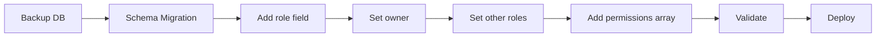

# RBAC Design Proposal for Kiwichito Platform

**Author:** Pablo Huamani (phuaman)
**Date:** 2026-09-28
**Status:** 🔍 Under Review
**Version:** 1.0

---

## Table of Contents

1. [Executive Summary](#executive-summary)
2. [Current State Analysis](#current-state-analysis)
3. [Proposed RBAC Design](#proposed-rbac-design)
4. [2026 Best Practices Evaluation](#2026-best-practices-evaluation)
5. [Devil's Advocate Analysis](#devils-advocate-analysis)
6. [Revised Recommendations](#revised-recommendations)
7. [Implementation Strategy](#implementation-strategy)
8. [Decision Log](#decision-log)

---

## Executive Summary

### Problem Statement
Current authentication system has no role hierarchy - all granted users have equal access with no ability to revoke or limit permissions.

### Proposed Solution
Implement Role-Based Access Control (RBAC) with:
- Master account (owner) with full control
- Role hierarchy (owner → admin → viewer)
- Demo-level access control
- Audit logging

### Key Question
**Is this approach correct and aligned with 2026 best practices?**

---

## Current State Analysis

### Database: `kiwichitoDb.userAccess`

```javascript
// Current schema (no roles)
{
  uid: "...",
  email: "kiwichito@gmail.com",
  status: "granted",  // Only field controlling access
  requestedAt: ISODate("..."),
  updatedAt: ISODate("...")
}
```

### Current Users
1. kiwichitos@gmail.com - granted
2. kiwichito@gmail.com - granted
3. kiwichitowork@gmail.com - granted
4. pchuaman@gmail.com - granted
5. tiktok-mcp-prototype - granted (service account)

### Security Gaps
- ❌ No one can revoke access
- ❌ No role differentiation
- ❌ No audit trail
- ❌ No demo-level permissions
- ❌ No principle of least privilege
- ❌ Service account has same access as humans

---

## Proposed RBAC Design

### Role Hierarchy

```
OWNER (kiwichito@gmail.com)
  └── Can grant/revoke access
  └── Can change roles
  └── Full system access
      │
      ├── ADMIN
      │     └── Manage demos
      │     └── View all demos
      │     └── View analytics
      │
      └── VIEWER
            └── View assigned demos only
            └── No admin access
```

### Permission Model

```javascript
{
  role: "owner",
  permissions: {
    users: { list: true, grant: true, revoke: true, changeRole: true },
    demos: { viewAll: true, create: true, edit: true, delete: true },
    analytics: { view: true, export: true, delete: true },
    settings: { system: true }
  },
  demoAccess: {
    mode: "all",  // "all" | "whitelist" | "blacklist"
    demoIds: []
  }
}
```

### Audit Logging

```javascript
// New collection: auditLog
{
  timestamp: ISODate("..."),
  action: "user.grant",
  performedBy: { uid: "...", email: "...", role: "owner" },
  target: { type: "user", id: "...", email: "..." },
  changes: { before: {...}, after: {...} }
}
```

---

## 2026 Best Practices Evaluation

### ✅ What Aligns with 2026 Standards

| Practice | Status | Implementation |
|----------|--------|----------------|
| **Principle of Least Privilege** | ✅ Partial | Viewers get minimal access, but needs granularity |
| **Audit Logging** | ✅ Yes | All admin actions logged |
| **Immutable Owner** | ✅ Yes | Owner cannot be revoked |
| **Explicit Permissions** | ✅ Yes | Permissions object defines capabilities |
| **Zero Default Access** | ✅ Yes | New users get no demo access |

### ⚠️ What Needs Improvement

| Practice | Gap | 2026 Expectation |
|----------|-----|------------------|
| **ABAC over RBAC** | Using RBAC only | Attribute-Based Access Control for fine-grained permissions |
| **Policy-as-Code** | Hardcoded permissions | Use OPA (Open Policy Agent) or similar |
| **Zero Trust** | Trust after auth | Continuous verification, context-aware access |
| **Break-Glass Access** | No emergency access | Emergency procedures for owner lockout |
| **JIT (Just-in-Time) Access** | Permanent roles | Time-limited, on-demand privilege escalation |
| **Separation of Duties** | Owner does everything | Split critical operations |
| **MFA for Admin Actions** | Not specified | Require MFA for sensitive operations |
| **Service Account Management** | Same as users | Separate identity type with rotation |
| **Access Reviews** | No periodic reviews | Regular certification of access rights |
| **Scope-based Tokens** | Not mentioned | JWT scopes for API granularity |

### ❌ Missing Modern Patterns

| Pattern | Current | 2026 Best Practice |
|---------|---------|-------------------|
| **Multi-tenancy** | Single tenant | Organization/project isolation |
| **Delegated Admin** | Owner-only admin | Admins can manage their scope |
| **Policy Engine** | In-app logic | External policy evaluation (OPA) |
| **Contextual Access** | Static roles | Context-aware (IP, time, device) |
| **Federated Identity** | Firebase only | OIDC, SAML support |
| **Credential Rotation** | No rotation | Regular key/token rotation |
| **Anomaly Detection** | No detection | AI-based access pattern monitoring |

---

## Devil's Advocate Analysis

### 🔴 Critical Concerns

#### 1. **Complexity vs. Project Scale**
**Challenge:** Are we over-engineering for a personal/demo website?

**Arguments:**
- You have 5 users total - do you need enterprise RBAC?
- Simple email whitelist might be sufficient
- Maintenance overhead: migrations, testing, documentation
- More code = more bugs = more attack surface

**Counter:**
- You mentioned wanting to grow this platform
- Better to build it right than retrofit later
- Analytics dashboard needs proper auth anyway
- Professional portfolio piece

**Verdict:** ⚠️ Valid concern - keep it simple but extensible

---

#### 2. **Single Owner = Single Point of Failure**
**Challenge:** What if owner account is compromised or inaccessible?

**Risks:**
- Owner Gmail hacked → attacker has full control
- Owner forgets password → entire system locked
- Owner account suspended by Google → no recovery
- Owner wants to delegate but can't (vacation, emergency)

**Missing:**
- No co-owners or backup admins
- No break-glass emergency access
- No account recovery mechanism
- No ownership transfer process

**Verdict:** 🔴 Critical gap - needs emergency access strategy

---

#### 3. **Permission Model Complexity**
**Challenge:** Nested permission object is hard to maintain

```javascript
// Proposed (complex)
permissions: {
  users: { list: true, grant: true, revoke: true, changeRole: true },
  demos: { viewAll: true, create: true, edit: true, delete: true },
  analytics: { view: true, export: true, delete: true }
}

// Industry standard (simple)
permissions: [
  "users:list",
  "users:grant",
  "users:revoke",
  "demos:read",
  "demos:write",
  "analytics:read"
]
```

**Verdict:** ⚠️ Use flat permission strings (easier to check, extend, cache)

---

#### 4. **Demo Access Modes Too Complex**
**Challenge:** Three modes (all/whitelist/blacklist) increase cognitive load

```javascript
// Do we really need all three?
demoAccess: {
  mode: "all",        // Just use this for admin/owner
  mode: "whitelist",  // Use this for viewers
  mode: "blacklist"   // When would we use this?
}
```

**Simpler alternative:**
```javascript
// Just use array - empty = no access, ["*"] = all access
allowedDemos: ["demo1", "demo2"]  // or ["*"] for all
```

**Verdict:** ⚠️ Remove "blacklist" mode - YAGNI (You Aren't Gonna Need It)

---

#### 5. **No Temporal Access Control**
**Challenge:** All access is permanent until revoked

**Missing use cases:**
- Guest demo access for 24 hours
- Temporary admin for specific task
- Demo preview link expires after 1 week
- Service account credentials expire

**Modern approach:**
```javascript
{
  role: "viewer",
  expiresAt: ISODate("2026-10-05T00:00:00Z"),  // Auto-revoke
  grantedFor: { reason: "Demo review", duration: "24h" }
}
```

**Verdict:** ⚠️ Consider time-limited access for future

---

#### 6. **Audit Log Without Retention Policy**
**Challenge:** Logs grow forever without cleanup

**Risks:**
- Logs consume disk space indefinitely
- Old logs may contain PII (GDPR issue)
- No way to export or archive
- No alerting on suspicious patterns

**Needed:**
```javascript
// Retention & monitoring
auditLog: {
  retentionDays: 365,
  autoDelete: true,
  alertOn: ["user.grant", "user.revoke", "role.change"],
  exportFormat: "JSON" | "CSV"
}
```

**Verdict:** ⚠️ Add retention policy and monitoring

---

#### 7. **Service Accounts as Regular Users**
**Challenge:** `tiktok-mcp-prototype` is treated like human user

**Problems:**
- Service accounts need different auth (API keys, not OAuth)
- Need credential rotation
- Different audit requirements
- May need higher rate limits

**Better approach:**
```javascript
{
  type: "service",  // New field: "human" | "service"
  apiKey: "sk_...",
  rotateEvery: 90,  // days
  lastRotated: ISODate("..."),
  allowedIPs: ["192.168.12.179"]  // IP whitelist
}
```

**Verdict:** 🔴 Separate service account management

---

#### 8. **No Rate Limiting by Role**
**Challenge:** All users have same API limits

**Missing:**
```javascript
rateLimits: {
  owner: { requests: 10000, window: "1h" },
  admin: { requests: 1000, window: "1h" },
  viewer: { requests: 100, window: "1h" },
  service: { requests: 5000, window: "1h" }
}
```

**Verdict:** ⚠️ Add role-based rate limiting

---

#### 9. **Migration Risk**
**Challenge:** Changing existing user records is dangerous

**What could go wrong:**
- Migration script fails halfway → corrupted data
- Wrong user becomes owner → security breach
- Existing apps break → downtime
- Rollback fails → data loss

**Mitigation needed:**
- Dry-run mode
- Transaction support (MongoDB 4.0+)
- Automated tests before production
- Blue-green deployment
- Feature flags

**Verdict:** 🔴 Need robust migration testing

---

#### 10. **No Versioning Strategy**
**Challenge:** Permission model will evolve - how to handle versions?

**Future scenarios:**
- Add new permission → do old users get it?
- Remove permission → what breaks?
- Change role definition → how to migrate?

**Needed:**
```javascript
{
  schemaVersion: 2,  // Track permission model version
  migratedFrom: 1,
  migratedAt: ISODate("...")
}
```

**Verdict:** ⚠️ Add schema versioning from day 1

---

## Revised Recommendations

### Tier 1: Essential (MVP)

#### 1. **Simplified Role Model**
```javascript
{
  uid: "...",
  email: "kiwichito@gmail.com",

  // Core access control
  role: "owner",              // "owner" | "admin" | "viewer" | "service"
  type: "human",              // "human" | "service"
  status: "active",           // "active" | "revoked" | "suspended"

  // Simple permissions (flat array)
  permissions: [
    "users:*",                // Wildcard for owner
    "demos:read",
    "demos:write",
    "analytics:read"
  ],

  // Simple demo access (empty = none, ["*"] = all)
  allowedDemos: ["*"],

  // Temporal access
  expiresAt: null,            // null = permanent, date = auto-revoke

  // Audit
  createdBy: "system",
  createdAt: ISODate("..."),
  updatedBy: "...",
  updatedAt: ISODate("..."),

  // Versioning
  schemaVersion: 1
}
```

#### 2. **Permission String Convention**
```
resource:action[:scope]

Examples:
- users:read           → Can list users
- users:grant          → Can grant access
- users:revoke:self    → Can only revoke own access
- demos:read:assigned  → Can read assigned demos only
- demos:*              → All demo permissions
- *:*                  → God mode (owner only)
```

#### 3. **Role Templates**
```javascript
const ROLE_PERMISSIONS = {
  owner: ["*:*"],  // Everything

  admin: [
    "users:read",
    "demos:*",
    "analytics:read",
    "analytics:export"
  ],

  viewer: [
    "demos:read:assigned",
    "settings:read:self"
  ],

  service: [
    "api:read",
    "api:write"
  ]
};
```

#### 4. **Emergency Access (Break-Glass)**
```javascript
// Stored securely, separate from main DB
{
  recoveryCode: "kiwi-recovery-2026-a1b2c3d4",  // Generated once, print & store offline
  allowsAction: "owner.recovery",
  usableBy: ["pchuaman@gmail.com"],  // Backup admin list
  expiresAt: ISODate("2027-01-01"),
  requiresMFA: true
}

// Usage: If owner locked out, backup admin enters recovery code
// Temporary owner access granted for 1 hour to fix issue
```

#### 5. **Lightweight Audit**
```javascript
{
  timestamp: ISODate("..."),
  action: "user.revoke",           // Verb: grant, revoke, create, delete, etc.
  actor: "kiwichito@gmail.com",
  target: "pchuaman@gmail.com",
  result: "success",               // success | failure

  // Auto-delete after 365 days
  expiresAt: ISODate("2027-09-28")
}

// Index for TTL auto-cleanup
db.auditLog.createIndex({ expiresAt: 1 }, { expireAfterSeconds: 0 })
```

### Tier 2: Important (Phase 2)

#### 6. **Service Account Separate Schema**
```javascript
// Different collection: serviceAccounts
{
  id: "sa_tiktok_mcp_2026",
  name: "TikTok MCP Service",
  apiKey: "sk_live_...",        // Hashed in DB
  secretKey: "...",             // Hashed, for signature verification

  permissions: ["tiktok:read", "tiktok:write"],

  // Security
  allowedIPs: ["192.168.12.179"],
  rotateEvery: 90,
  lastRotated: ISODate("..."),
  nextRotation: ISODate("..."),

  // Rate limiting
  rateLimit: { requests: 5000, window: "1h" },

  // Audit
  createdBy: "owner",
  expiresAt: null
}
```

#### 7. **Context-Aware Access**
```javascript
// Check more than just role
function canAccess(user, resource, action, context) {
  // Basic RBAC check
  if (!user.permissions.includes(`${resource}:${action}`)) {
    return false;
  }

  // Context checks (2026 zero-trust principles)
  if (context.ip && user.trustedIPs) {
    if (!user.trustedIPs.includes(context.ip)) {
      return "require_mfa";  // Suspicious IP → require MFA
    }
  }

  if (context.time && user.allowedHours) {
    if (!isWithinHours(context.time, user.allowedHours)) {
      return false;  // Outside allowed hours
    }
  }

  return true;
}
```

#### 8. **MFA for Critical Actions**
```javascript
// Require MFA for sensitive operations
const MFA_REQUIRED_ACTIONS = [
  "users:grant",
  "users:revoke",
  "users:changeRole",
  "settings:system",
  "analytics:delete"
];

// Before performing action
if (MFA_REQUIRED_ACTIONS.includes(action)) {
  const mfaValid = await verifyMFA(user.uid, mfaToken);
  if (!mfaValid) {
    throw new Error("MFA verification required");
  }
}
```

### Tier 3: Future (Nice to Have)

#### 9. **Policy-as-Code (OPA Integration)**
```rego
# policies/demo_access.rego
package kiwichito.demos

default allow = false

# Owner can do anything
allow {
  input.user.role == "owner"
}

# Admin can read all demos
allow {
  input.user.role == "admin"
  input.action == "read"
}

# Viewer can read assigned demos
allow {
  input.user.role == "viewer"
  input.action == "read"
  input.demo.id in input.user.allowedDemos
}
```

#### 10. **Access Review Workflow**
```javascript
// Periodic access certification
{
  reviewId: "2026-Q4-access-review",
  dueDate: ISODate("2026-12-31"),
  status: "pending",

  usersToReview: [
    { uid: "...", email: "pchuaman@gmail.com", role: "admin", certifiedBy: null }
  ],

  // Owner must certify each user still needs access
  // Auto-revoke if not certified by due date
}
```

---

## Implementation Strategy

### Phase 1: Foundation (Week 1)
**Goal:** Basic RBAC with owner protection



**Tasks:**
1. ✅ Database backup
2. ✅ Create migration script (simplified permissions)
3. ✅ Set kiwichito@gmail.com as owner
4. ✅ Set others as viewers with no demo access
5. ✅ Add basic audit log collection
6. ✅ Create rollback script
7. ✅ Write validation tests

**Deliverables:**
- `migration-rbac-v1.js` - Migration script
- `rollback-rbac-v1.js` - Rollback script
- `test-rbac-migration.js` - Tests
- Updated ANALYTICS.md

---

### Phase 2: API & Permissions (Week 2)
**Goal:** Backend endpoints for user management

**Tasks:**
1. ✅ Create `/api/admin/users` endpoints
2. ✅ Add permission middleware (`canUserDo(uid, action)`)
3. ✅ Implement demo access validation
4. ✅ Add audit logging to all admin actions
5. ✅ Add rate limiting by role
6. ✅ Write API tests
7. ✅ Add emergency recovery mechanism

**Endpoints:**
```
GET    /api/admin/users              → List users (owner, admin)
POST   /api/admin/users/:uid/grant   → Grant access (owner only)
POST   /api/admin/users/:uid/revoke  → Revoke access (owner only)
PATCH  /api/admin/users/:uid/role    → Change role (owner only)
PATCH  /api/admin/users/:uid/demos   → Assign demos (owner, admin)
GET    /api/admin/audit-log          → View audit log (owner only)
POST   /api/admin/emergency-access   → Break-glass recovery (requires code)
```

---

### Phase 3: Admin Dashboard (Week 3)
**Goal:** UI for managing users and permissions

**Components:**
```
/admin
  /users           → User management page
    - List all users with roles
    - Grant/revoke buttons
    - Role dropdown
    - Demo assignment checkboxes
    - Expire access (set expiresAt)

  /audit-log       → Audit log viewer
    - Filter by action, user, date
    - Export to CSV

  /demos           → Demo management
    - Mark demos as public/restricted
    - Assign users to demos

  /settings        → System settings (owner only)
    - MFA settings
    - Rate limits
    - Security policies
```

**Tech Stack:**
- React (you're learning) or Angular (familiar)
- Tailwind CSS for styling
- React Query for API calls
- Chart.js for audit visualizations

---

### Phase 4: Service Accounts (Week 4)
**Goal:** Separate service account management

**Tasks:**
1. ✅ Create `serviceAccounts` collection
2. ✅ API key generation & hashing
3. ✅ Credential rotation workflow
4. ✅ IP whitelist enforcement
5. ✅ Service-specific rate limits
6. ✅ Separate audit log

---

### Phase 5: Advanced Security (Future)
**Goal:** Zero-trust, MFA, policy engine

**Tasks:**
- MFA for critical actions
- Context-aware access (IP, time, device)
- OPA policy engine integration
- Anomaly detection
- Access review workflow

---

## Decision Log

### Decision 1: RBAC vs ABAC
**Question:** Should we use Role-Based or Attribute-Based Access Control?

**Options:**
1. **RBAC** - Roles with fixed permissions
   - ✅ Simpler to implement
   - ✅ Easier to understand
   - ❌ Less flexible

2. **ABAC** - Attributes define access
   - ✅ Very flexible
   - ✅ Fine-grained control
   - ❌ Complex to implement
   - ❌ Harder to debug

**Decision:** Start with RBAC, design for future ABAC migration

**Rationale:**
- Project is small (5 users, ~10 demos)
- RBAC covers 90% of use cases
- Can add ABAC later without breaking changes
- Keep permission model extensible

---

### Decision 2: Permission Storage Format
**Question:** Nested object vs flat array?

**Options:**
1. **Nested Object**
   ```javascript
   permissions: {
     users: { list: true, grant: true },
     demos: { read: true, write: true }
   }
   ```
   - ✅ Self-documenting
   - ❌ Hard to check permissions
   - ❌ Harder to extend

2. **Flat Array of Strings**
   ```javascript
   permissions: ["users:list", "users:grant", "demos:read"]
   ```
   - ✅ Simple to check: `permissions.includes("users:grant")`
   - ✅ Easy to add/remove
   - ✅ Industry standard (AWS IAM, Auth0, etc.)
   - ✅ Supports wildcards: `"demos:*"`

**Decision:** Flat array of strings

**Rationale:**
- Follows industry standards (AWS IAM, Kubernetes RBAC, Auth0)
- Simpler permission checks
- Better performance (indexed arrays)
- Supports future expansion

---

### Decision 3: Demo Access Model
**Question:** Three modes (all/whitelist/blacklist) or simpler?

**Options:**
1. **Three Modes** (proposed initially)
   - ❌ Complex
   - ❌ When would blacklist be used?

2. **Array with Wildcard**
   ```javascript
   allowedDemos: ["*"]        // All access
   allowedDemos: ["demo1"]    // Specific demos
   allowedDemos: []           // No access
   ```
   - ✅ Simple
   - ✅ Clear semantics
   - ✅ Easy to check

**Decision:** Array with wildcard (`["*"]` for all)

**Rationale:**
- YAGNI - blacklist mode not needed
- Simpler code, fewer bugs
- Clear intent

---

### Decision 4: Single vs Multiple Owners
**Question:** Allow only 1 owner or support co-owners?

**Options:**
1. **Single Owner**
   - ✅ Clear responsibility
   - ❌ Single point of failure

2. **Multiple Owners (Co-owners)**
   - ✅ No single point of failure
   - ✅ Shared responsibility
   - ❌ Coordination overhead
   - ❌ More complex

**Decision:** Single owner + emergency recovery mechanism

**Rationale:**
- This is your personal platform
- Add break-glass recovery for emergencies
- Can revisit if platform becomes multi-tenant

---

### Decision 5: Migration Strategy
**Question:** Big bang migration or gradual rollout?

**Options:**
1. **Big Bang** - Migrate everything at once
   - ✅ Simpler
   - ❌ Higher risk

2. **Gradual** - Feature flags, A/B test
   - ✅ Lower risk
   - ✅ Easy rollback
   - ❌ More complex

**Decision:** Big bang with comprehensive testing + quick rollback

**Rationale:**
- Low user count (5 users)
- Can schedule downtime
- Faster to complete
- Rollback script ready

---

### Decision 6: Where to Apply RBAC
**Question:** Just analytics or entire kiwichito platform?

**Scope:**
1. **Analytics Only** - New dashboard only
2. **Platform-wide** - All kiwichito apps (demos, admin, analytics)

**Decision:** Platform-wide, starting with analytics

**Rationale:**
- Centralized auth is better long-term
- Reuse auth for all future projects
- Analytics dashboard is good starting point
- Can extend to demo access control later

---

## Final Recommendations

### ✅ Do This Now

1. **Use simplified RBAC model**
   - Flat permission arrays
   - Three roles: owner, admin, viewer
   - Simple demo access (array with wildcard)

2. **Add emergency recovery**
   - Recovery code stored offline
   - Backup admin list
   - Time-limited emergency access

3. **Implement basic audit logging**
   - Log all admin actions
   - TTL-based auto-deletion (365 days)
   - Simple query interface

4. **Separate service accounts**
   - Different collection
   - API key auth
   - Rotation schedule

5. **Add temporal access**
   - `expiresAt` field for time-limited access
   - Auto-revoke on expiry

6. **Schema versioning**
   - Track permission model version
   - Plan for future migrations

### ⚠️ Consider Later

1. **Context-aware access** - IP, time, device checks
2. **MFA for critical actions** - Require 2FA for grants/revokes
3. **Policy-as-code** - OPA integration
4. **Access reviews** - Periodic certification
5. **Anomaly detection** - Monitor unusual patterns

### ❌ Don't Do

1. **Over-engineer for scale you don't have**
2. **Add features "just in case"**
3. **Complex blacklist/whitelist modes**
4. **Nested permission objects**

---

## Open Questions

1. **Should admins be able to grant viewer access?**
   - Pro: Reduces owner bottleneck
   - Con: More attack surface
   - **Recommendation:** Phase 2 feature

2. **How to handle user deletion vs revocation?**
   - Delete: Remove from DB (can't reactivate)
   - Revoke: Keep in DB with status=revoked (can reactivate)
   - **Recommendation:** Use revocation, add hard-delete for owner only

3. **Should demo creators auto-get access to their demos?**
   - **Recommendation:** Yes, add to allowedDemos on creation

4. **Rate limiting by role - what are fair limits?**
   - **Recommendation:** Start generous, tighten based on usage

5. **Where to build admin dashboard?**
   - Option A: Separate repo
   - Option B: Part of kiwichito.com Angular app
   - Option C: Part of analytics-server (React)
   - **Recommendation:** Ask user preference

---

## Next Steps

### Immediate Actions

1. **Review this document**
   - Validate assumptions
   - Challenge decisions
   - Identify gaps

2. **Make key decisions**
   - Single vs co-owners?
   - Where to build admin UI?
   - Gradual vs big bang?

3. **Create migration plan**
   - Write scripts
   - Test on backup DB
   - Validate results

4. **Schedule implementation**
   - Block time
   - Set milestones
   - Plan rollback

### Questions for You

1. **Is this complexity justified for your platform?**
   - Do you plan to scale beyond 10-20 users?
   - Is this for learning or production?

2. **Emergency access - who should be backup admin?**
   - pchuaman@gmail.com?
   - Another trusted person?

3. **Where should admin dashboard live?**
   - Separate React app?
   - Part of existing Angular kiwichito.com?
   - Built into analytics-server?

4. **Timeline preference?**
   - Quick & simple (1 week)?
   - Comprehensive (4 weeks)?

---

**Status:** 🔍 Awaiting feedback and decision on implementation approach

**Last Updated:** 2026-09-28
**Document Owner:** Pablo Huamani
